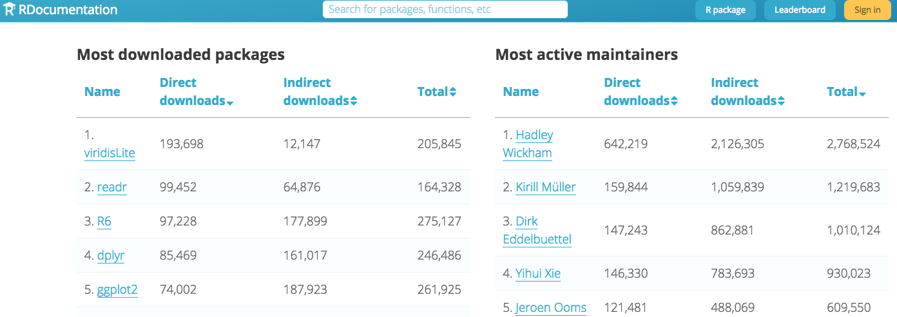
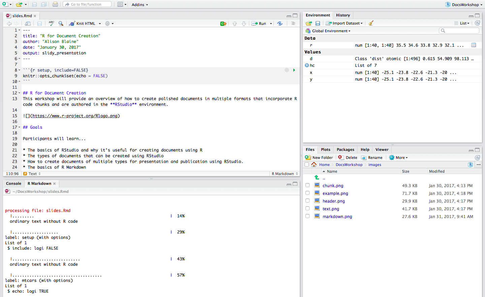
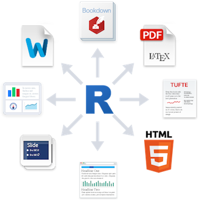
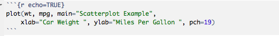
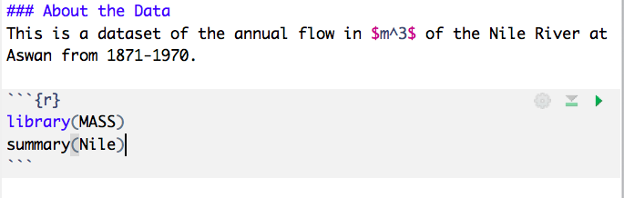

R Markdown for Publishing Documents
================
Alison Blaine, NCSU Libraries
October 2017

Overview
--------

This session will provide an overview of how to create polished documents that incorporate R code chunks. For the purposes of convenience, we will use the **RStudio** environment. 

Warning
-------

**This WILL be a hands-on workshop.**


Access to RStudio server
------------------------

You should have a paper slip on your seat with a URL and login information to an RStudio server instance.

### **URL: go.ncsu.edu/ato**

#### **username: check your slip**

#### **password: check your slip**

R
-

R is a programming language for statistical computing and graphics.

-   open-source
-   intended to be a user-friendly alternative to costly software
-   created by statisticians named **Ross** and **Robert** (I see what you did there.)
-   one of the most popular languages for data science

R Packages
----------

Base R is extended by packages that can be imported into R. Currently there are over 13,000 registered packages. Find packages at [RDocumentation.org](http://RDocumentation.org)



R Studio
--------



R packages for document creation
--------------------------------

-   **rmarkdown** - converts R Markdown documents into a variety of formats. Based on pandoc. Already included with RStudio.
-   **knitr** - generates dynamic reports. Combines a bunch of packages into one tool. Already included with RStudio.
-   **pandoc** - converts documents from one markup format to another. Included in RStudio.
-   **LaTeX (for PDFs)** - must be installed separately. Typesetting system designed for the production of documentation.
-   **bookdown** - if you want to write books

[More information](http://stackoverflow.com/questions/40563479/relationship-between-r-markdown-knitr-pandoc-and-bookdown) about how these packages work together

R Markdown Lets Us Have Nice Things
-----------------------------------



One .Rmd file --&gt; many types of documents:

-   HTML files / websites
-   PDF
-   Microsoft Word
-   Interactive documents (Shiny apps)
-   Slide presentations
-   Books
-   Journal articles

image credit: [R Studio](http://rmarkdown.rstudio.com/)

[Examples from the R Markdown Gallery](http://rmarkdown.rstudio.com/gallery.html)

Reproducibility
---------------

-   other people can re-run your code
-   transparency for other researchers
-   files are dynamic
-   easy to share

Versatility
-----------

In an R Markdown file, you can include:

-   HTML
-   LaTeX
-   mathjax
-   code chunks in other languages

What is R Markdown?
-------------------

**R Markdown** is a version of Markdown, a **text markup tool**, adapted for use in R.

R Markdown documents are fully reproducible and support dozens of static and dynamic output formats.


How it works
------------

An R Markdown file (.Rmd) is the file that you will use to create your document.

A typical file has three components:

-   header
-   code chunks
-   text

Header
------

    ---
    title: "R Markdown for Publishing Documents"
    author: "Alison Blaine"
    date: "October 2017"
    output: html_document
    ---

Written in YAML, a format common for configuration files

**Output options**:

html\_document, pdf\_document, word\_document, md\_document, ioslides\_presentation, slidy\_presentation, beamer\_presentation, revealjs\_presentation (revealjs package must be installed)

Code chunks
-----------

Make a code chunk with 3 backticks then {r}. End chunk with 3 backticks:



Example
-------

``` r
attach(mtcars)
plot(wt, mpg, main="Scatterplot Example",
    xlab="Car Weight ", ylab="Miles Per Gallon ", pch=19)  
```


Text
----

Formatting text requires R Markdown notation. See R Markdown Reference Guide for more examples.


normal text
*italics*
**bold**
[hyperlink example](http://www.ncsu.edu)

Knitting Your R Markdown File
-----------------------------

Save your .Rmd file, and click the *"Knit"* button that appears above the file.

You can set certain output options by clicking on the gear icon next to the Knit button.


Chunk options
-------------

Using chunk options, you can set rules for your code chunks.

-   to specify the dimensions of a figure
-   to make it so a code chunk does not appear in the final document
-   to show or hide the code in the code chunk
-   to display or not display error messages generated by the code

`{r echo=TRUE, eval=FALSE}`

See [R Markdown reference guide](https://www.rstudio.com/wp-content/uploads/2015/03/rmarkdown-reference.pdf) for more examples!

Example 1
---------

`{r echo=TRUE}`

``` r
plot(wt, mpg, main="Scatterplot Example",
    xlab="Car Weight ", ylab="Miles Per Gallon ", pch=19)  
```


Example 2
---------

`{r echo=FALSE}`


Global Chunk Options
--------------------

These provide rules for all of the chunks in the document.

Example: `knitr::opts_chunk$set(echo = FALSE)`


Hands-On Part Begins
--------------------


Use the paper slip on to log in to RStudio:

### **URL: go.ncsu.edu/ato**

#### **username: check your slip**

#### **password: check your slip**

Exercise 1: Create an R Markdown file
-------------------------------------

1.  **Log in to RStudio at go.ncsu.edu/ato** (or open RStudio on your computer)
2.  File &gt; New File &gt; R Markdown
3.  Select HTML
4.  Title it "HelloWorld"
5.  Click the save button. Save as "HelloWorld"
6.  Click "Knit Html" to see it render as an HTML file

Change Your Global Chunk Option
-------------------------------

Try setting your global chunk option to the following. Each time, knit the code to see changes.

`knitr::opts_chunk$set(echo = FALSE)`

`knitr::opts_chunk$set(eval = FALSE)`

Knit as a Word Doc
------------------

Change `output: html_document` to `output: word_document` in your header (if you have word). If not, try `output: pdf_document`.

    ---
    title: "Hello World"
    author: "Alison Blaine"
    date: "10/11/2017"
    output: word_document
    ---

Open Nile.Rmd file
------------------



Overview of Nile.Rmd
--------------------

This is a dataset of the annual flow (in *m*<sup>3</sup>) of the Nile River at Aswan from 1871–1970.

Inside your code chunk should be two commands:

``` r
library(MASS)
summary(Nile)
```

`library(MASS)` -loads the MASS library of sample datasets
`summary(Nile)` - shows the statistical summary of the data set

Add a plot
----------

Skip a line and then create a new R code chunk under the previous one. Add a plot inside the chunk with the following command:

    plot(Nile)


Resize the plot by adding a chunk option
----------------------------------------

\`{r fig.width=5, fig.height=5, echo=TRUE, eval=FALSE}

``` r
plot(Nile)
```


Templates
---------

There are existing R Markdown templates for html files, slide shows, and scholarly journal article formats.

Examples: \* github document \* Package Vignette (HTML) \* [tufte](http://rstudio.github.io/tufte/) is a template for handouts in the style of Edward Tufte. \* [rticles](https://github.com/rstudio/rticles) is a LaTeX academic journal R package.

To use a template, you can install the template package:

install.packages("rticles", type = "source")

Or, you can download a template .Rmd file and edit it in R Studio, such as this [scientific template](http://www.petrkeil.com/?p=2401).

Opening a Template from Installed Package in RStudio
----------------------------------------------------

After installing the rticles package:

1.  File &gt; New File &gt; R Markdown...
2.  Select "From Template"

The window should populate with templates from the rticles package

Note: a *full installation of LaTeX is required* for this to work.

Convert Your Document to a Slide Presentation
---------------------------------------------

Pandoc will allow you to convert your html file into a slide presentation.

Here are some slide presentation types you can create in RStudio:

-   ioslides\_presentation
-   slidy\_presentation
-   Beamer (PDF output) - requires a LaTex installation
-   RevealJS - requires installing the "revealjs" package

Example
-------

In the header of HelloWorld.Rmd, change output type to "slidy\_presentation" and knit the document

Styling your Slides
-------------------

-   You can add a [CSS (Cascading Style Sheet)](https://en.wikipedia.org/wiki/Cascading_Style_Sheets) file to your project if you want to change the styling of your Slide presentation.
-   The CSS file must be included in your project directory and named in the header.
-   You can also specify presentation size and text size in the header.
-   Beamer only renders slides in PDF. [Lots of themes](https://www.sharelatex.com/learn/Beamer#/Themes_and_colorthemes) are available.

``` yaml
 ---
 output: 
   ioslides_presentation:
      css: styles.css
---
```

For more information, see the [documentation](http://rmarkdown.rstudio.com/lesson-11.html)

Including Shiny in R Markdown
-----------------------------

-   Shiny is an R framework for creating interactive web applications.
-   Shiny applications can be embedded into an R markdown file, or exist as stand-alone applications.

-   Lots of tutorials exist for creating Shiny applications or Shiny widgets embedded in R Markdown documents.

Here are some good ones:

-   [Shiny R Studio tutorial](https://shiny.rstudio.com/articles/interactive-docs.html)
-   [How to Build a Shiny App](http://shiny.rstudio.com/tutorial/)
-   [How to Start with Shiny - Pt 1](https://www.rstudio.com/resources/webinars/how-to-start-with-shiny-part-1/)

Open Shiny\_Nile.Rmd
--------------------

File &gt; New File &gt; R Markdown &gt; Shiny &gt; Shiny Document

`output: html_document`
`runtime: shiny`

Shiny documents have "Run Document" buttons. Click this to render the document.

When you save the file, you'll notice that the "Run Document" button appears

Shiny Code Chunk
----------------

After the line plot code, the highlighted code chunk to create an interactive histogram.

``` r
# create dropdown selector for histogram
inputPanel(
  selectInput("n_breaks", label= "Bins", c(10, 20, 30, 40), selected = 10)  #creates a dropdown selector
)

# create histogram
renderPlot({
hist(Nile, xlab= "Measurement", probability = TRUE, breaks = as.numeric(input$n_breaks), col="deepskyblue3") 
})
```

Run the document. The histogram will update when a new value is selected from the dropdown menu.
