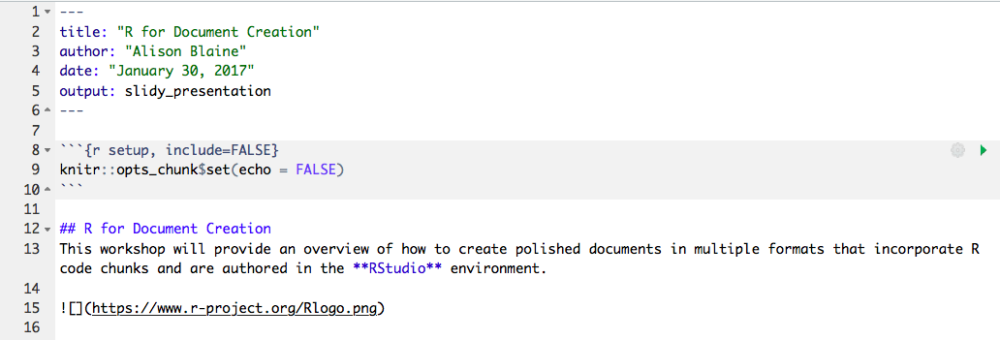
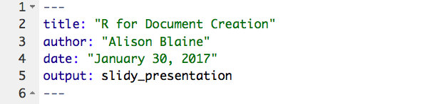
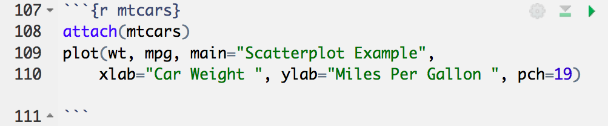
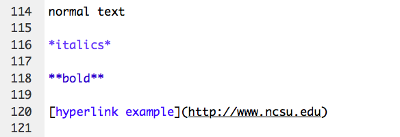
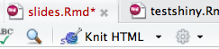
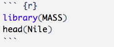
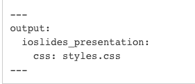
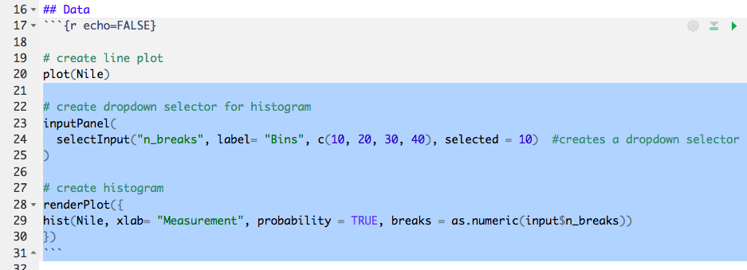

```{r setup, include=FALSE}
knitr::opts_chunk$set(echo = FALSE, fig.width = 4, fig.height = 3)
```

## Overview
This workshop will provide an overview of how to create polished documents in multiple formats that incorporate R code chunks and are authored in the **RStudio** environment. 


## Goals
Participants will learn...

* The basics of RStudio
* R packages and dependencies
* R Markdown syntax and file structure
* How to embed R code into documents
* Document conversion steps
* Chunk commands


## RStudio
R Studio is a free and open-source integrated development environment (IDE) for R, a programming language for statistical computing and graphics. This is the software we will be using to create our documents. 

You must [install R](https://www.r-project.org/) before installing RStudio.


## Required R packages
* **rmarkdown** - R package that converts R Markdown documents into a variety of formats. Based on pandoc. Already included with RStudio.
* **knitr** - R package that generates dynamic reports. Combines a bunch of packages into one tool. Already included with RStudio.
* **pandoc** - R package for converting documents from one markup format to another. Included in RStudio.
* **LaTeX (for PDFs)** - software not included, must be installed separately. Typesetting system designed for the production of technical and scientific documentation.
    * MacTeX (Mac)
    * MiKTeX (Windows)

[More information](http://stackoverflow.com/questions/40563479/relationship-between-r-markdown-knitr-pandoc-and-bookdown) about how these packages work together


## Document Types
- HTML files / websites
- PDF
- Microsoft Word 
- Interactive documents (Shiny apps)
- Slide presentations
- Books
- Journal articles
- etc


## Embedded Code
This is an example of the output of an embedded code chunk.
```{r mtcars, echo = TRUE}
head(mtcars, 3)
```


## Visualizations
```{r fig.width=5, fig.height=3}
attach(mtcars)
plot(wt, mpg, main="Scatterplot Example", 
  	xlab="Car Weight ", ylab="Miles Per Gallon ", pch=19)  
```


## R Markdown
R Markdown is a version of Markdown, a text markup tool, adapted for use in R. It's a simpler and more efficient markup language than HTML. 

You can use a single R Markdown file to...

* save and execute code (written in R, Python, etc)
* generate high quality reports that can be shared with an audience (with knitr)

R Markdown documents are fully reproducible and support dozens of static and dynamic output formats.

[Examples from the R Markdown Gallery](http://rmarkdown.rstudio.com/gallery.html)


## How it works
An R Markdown file is the file that you will use to create your document. 

You can create this file in the RStudio editor, run it and generate the document using the Knit button.

R Markdown files have extension (.Rmd)

A typical file has three components:

- header 
- R code chunks
- text


## Example R Markdown File


The arrows on the right let you run each code chunk. 

R Markdown formatting tells the software how to format the text and whether to display/run the code.


## Header 


Written in YAML, a format common for configuration files

Title is whatever you want to title it

**output options** (choose one): 
html_document, pdf_document, word_document, md_document, ioslides_presentation, slidy_presentation, beamer_presentation

You can change the output file format just by changing this one line of code.


## Code chunks 
Make a code chunk with 3 backticks then {r}. 
End chunk with 3 backticks:




## Text
Formatting text requires R Markdown notation. See R Markdown Reference Guide for more examples.



normal text

*italics*

**bold**

[hyperlink example](http://www.ncsu.edu)


## Rendering your R Markdown file into a document
Save your .Rmd file, and click the *"Knit"* button that appears above the file.

You can set certain output options by clicking on the gear icon next to the Knit button.




## Markdown Tutorial
This short exercise is to familiarize you with the basics of text formatting with Markdown. R Markdown uses these same text formatting rules.

Complete lessons 1-10 at [www.markdown-tutorial.com](http://www.markdown-tutorial.com)


## Practice: Create an R Markdown file 
output type: html_document

Instructions:

1. Open RStudio
2. Files > New Folder
3. Create a folder called "RDocsWorkshop"
4. Set as working directory (Click "More" > "Set as Working Directory")
5. File > New File > R Markdown
6. Select HTML
7. Title it "HelloWorld"
8. Click the save button. Save as "HelloWorld"
9. Click "Knit Html" to see it render as an HTML file
10. Change "Knit Html" using the dropdown to Knit to Word" to convert it to a Microsoft Word file


## Chunk options
Using chunk options, you can set rules for your code chunks. Use cases:

* to specify the dimensions of a figure
* to make it so a code chunk does not appear in the final document
* to not run the code in the code chunk
* to not display error messages generated by the code

See [R Markdown reference guide](https://www.rstudio.com/wp-content/uploads/2015/03/rmarkdown-reference.pdf) for more examples! 


## Example 1 
{r echo=TRUE}

```{r echo=TRUE}
plot(wt, mpg, main="Scatterplot Example", 
  	xlab="Car Weight ", ylab="Miles Per Gallon ", pch=19)  
```


## Example 2 
{r echo=FALSE}

```{r echo=FALSE}
plot(wt, mpg, main="Scatterplot Example", 
  	xlab="Car Weight ", ylab="Miles Per Gallon ", pch=19)  
```


## How to set global Chunk Options
These provide rules for all of the chunks in the document. 

Example:
knitr::opts_chunk$set(echo = FALSE, fig.width = 4, fig.height = 3)


## Activity
1. Knit HelloWorld.Rmd
2. Change line 9 in your HelloWorld.Rmd file to the following:

**knitr::opts_chunk$set(echo = FALSE)**

3. Knit the file. Examine the output. What has changed?
4. Now Change line 9 to 

**knitr::opts_chunk$set(eval = FALSE)**

5. Knit the file. What has changed?

6. Change line 9 to 

**knitr::opts_chunk$set(collapse = TRUE)**


## Edit the text 
1. Delete boilerplate text and code chunks (lines 12 to the end)
2. Give the document a new title: "Measuring Nile Flow" in the header
3. Create an R code chunk

Inside your code chunk should be two commands: 


**library(MASS)**  # this loads the MASS library of sample datasets

**head(Nile)** # shows the first row of the data set




## Add a Plot
Add a plot below your head(Nile) code. 

plot(Nile)

```{r}
plot(Nile)
```


## Resize the Plot
{r fig.width=6, fig.height=5}

plot(Nile)

```{r fig.width=6, fig.height=5}
plot(Nile)
```


## Add text to the document
This is a dataset of the annual flow (in $m^3$) of the Nile River at Aswan from 1871–1970.

*To activate LaTeX typsetting, put dollar signs $ before and after m^3


## Convert to Word Doc or PDF
It's easy to convert your HTML file to a PDF or Word document. Simply click the dropdown arrow next to Knit to HTML and choose a different document type. 


## Templates
There are existing R Markdown templates for html files, slide shows and scholarly journal article formats, to name a few. 

Examples:

* [tufte](http://rstudio.github.io/tufte/) is a template for handouts in the style of Edward Tufte.

* [rticles](https://github.com/rstudio/rticles) is a LaTeX academic journal R package. 

To use a template, you can install the template package: 

install.packages("rticles", type = "source")

Or, you can download a template .Rmd file and edit it in R Studio, such as this [scientific template](http://www.petrkeil.com/?p=2401).


## Opening a Template from Installed Package in RStudio
Once you have installed the rticles package: 

1. File > New File > R Markdown... 
2. Select "From Template"

The window should populate with templates from the rticles package

Note: a *full installation of LaTeX is required* for this to work. 

## Convert Your Document to a Slide Presentation
Pandoc will allow you to convert your html file into a slide presentation. 

Here are some slide presentation types you can create in RStudio: 

* ioslides_presentation
* slidy_presentation
* Beamer (PDF output) - requires a LaTex installation
* RevealJS - requires installing the "revealjs" package


## Example
In the header of HelloWorld.Rmd, change output type to "slidy_presentation" and knit the document 


## Styling your Slides 
* You can add a [CSS (Cascading Style Sheet)](https://en.wikipedia.org/wiki/Cascading_Style_Sheets) file to your project if you want to change the styling of your Slide presentation. 
* The CSS file must be included in your project directory and named in the header.
* You can also specify presentation size and text size in the header. 
* Beamer only renders slides in PDF. [Lots of themes](https://www.sharelatex.com/learn/Beamer#/Themes_and_colorthemes) are available.




For more information, see the [documentation](http://rmarkdown.rstudio.com/lesson-11.html)


## Creating a web application with Shiny
* Shiny is an R framework for creating interactive web applications.
* Shiny applications can be embedded into an R markdown file, or exist as stand-alone applications.

* Lots of tutorials exist for creating Shiny applications or Shiny widgets embedded in R Markdown documents. 


Here are some good ones:

* [Shiny R Studio tutorial](https://shiny.rstudio.com/articles/interactive-docs.html)
* [How to Build a Shiny App](http://shiny.rstudio.com/tutorial/)
* [How to Start with Shiny - Pt 1](https://www.rstudio.com/resources/webinars/how-to-start-with-shiny-part-1/)

## Open a Shiny Document 
File > New File > R Markdown > Shiny > Shiny Document 

Rather than a "knit" button, Shiny documents have "Run Document" buttons. Click this to render the document. 

## Turn your HelloWorld.Rmd into a Shiny Document
In your header...

* set output to **html_document**
* add **runtime:shiny**

output: html_document

runtime: shiny

When you save the file, you'll notice that the "Run Document" button appears

## Add Interactive Histogram
After the line plot code, add this code to create an interactive histogram:



Run the document. The histogram will update when a new value is selected from the dropdown menu.

## Histogram
```{r fig.width = 2}
inputPanel(
  selectInput("n_breaks", label= "Bins", c(10, 20, 30, 40), selected = 10)  #creates a dropdown selector
)

# create histogram
renderPlot({
hist(Nile, xlab= "Measurement", probability = TRUE, breaks = as.numeric(input$n_breaks)) 
})
```
